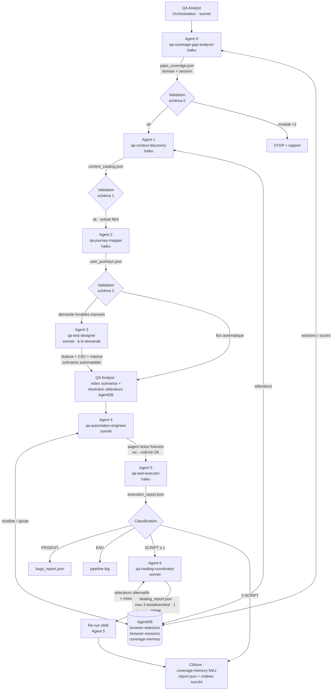

# Plateforme QA Autonome — Architecture multi-agents

Architecture agnostique au projet métier, orchestrée par l'agent **QA Analyst**,
compatible Claude Code, OpenCode, Codex, GitHub Copilot Agent Mode, Gemini CLI
et tout environnement MCP.

## 1. Vue d'ensemble



## 2. Principes structurants

**Neutralité métier.** Aucun agent ne contient de donnée projet. Tout le
spécifique (URL, rôles, credentials via variables d'environnement, routes
exclues, commandes) vit dans `.qa/qa.config.json` (voir
`.qa/qa.config.example.json`).

**Échange par fichiers.** Les agents ne partagent jamais de contexte
conversationnel. Chaque livrable est un JSON enveloppé `qa-mesh/2.0` écrit dans
`.qa/runs/{run_id}/`, validé contre son schéma (`.qa/contracts/*.schema.json`)
par le QA Analyst avant transmission. C'est ce qui rend l'architecture portable :
n'importe quel runtime capable de lire/écrire des fichiers peut héberger un agent.

**Transmission sélective.** Le QA Analyst est l'unique détenteur des livrables
complets et ne transmet à chaque agent que les champs qu'il consomme. Depuis
qa-mesh/2.0, cette table est DÉCLARATIVE dans `.qa/routing.yaml` (source unique)
et exécutée par `qa-mesh filter --from <a> --to <b>` — le tableau ci-dessous
n'est plus que documentaire :

| De → vers | Champs transmis |
|---|---|
| 0 → 1 | `domain`, routes du domaine, `session.storage_state_path`, sélecteurs connus |
| 1 → 2 | `pages[].{url,title,complexity}`, `elements[].{page,label,type,action}` |
| 1+2 → 3 | parcours complets + catalogue sans sélecteurs |
| 2/3 → 4 | index scénarios automatisables + index sélecteurs résolus AgentDB |
| 4 → 5 | chemins des specs + commande d'exécution |
| 5 → 6 | uniquement les échecs SCRIPT + contexte + sélecteurs candidats |

**Budgets explicites.** Tous les retries sont bornés et configurables
(`qa.config.json#budgets`) : 2 relances max par agent, 1 passe de healing,
3 tentatives par test, 2 rafraîchissements de session par campagne.

## 3. Structure du projet

```
your-project/
├── CLAUDE.md                  # Instructions équipe (committed)
├── CLAUDE.local.md            # Overrides perso (gitignored)
├── .claude/
│   ├── settings.json          # Permissions + config (committed)
│   ├── settings.local.json    # Permissions perso (gitignored)
│   ├── commands/              # /qa-campaign, /qa-coverage, /qa-heal
│   ├── rules/                 # code-style.md, testing.md, selectors.md
│   ├── skills/
│   │   └── playwright-best-practices/   # pack TestDino curaté (SKILL.md + references/)
│   └── agents/                # qa-analyst + agents 0-6
├── .qa/                       # config, contrats, AgentDB, runs
│   ├── qa.config.json         # SEULES données spécifiques projet (gitignoré si secrets)
│   ├── contracts/             # envelope + agent-0..6 (JSON Schema)
│   ├── agentdb/               # schema.json, browser-selectors.json, coverage-memory.json
│   │   └── sessions/          # storageState par rôle (gitignored)
│   └── runs/{run_id}/         # livrables + pipeline.log (gitignored)
├── tests/                     # specs PAR FEATURE : tests/<feature>/<feature>.<flux>.spec.ts
│   └── seed.spec.ts           # seed pour la génération
├── pages/                     # POM : <nom>.page.ts ; composants dans pages/components/
├── fixtures/                  # pages.fixture.ts — source unique de { test, expect }
├── utils/                     # test-data.ts, api-client.ts, helpers.ts
├── examples/                  # exemples de plans de test
├── playwright.config.ts
└── tsconfig.json
```

## 4. Les agents

| # | Nom | Modèle | Rôle | Livrable |
|---|---|---|---|---|
| — | `qa-analyst` | sonnet | Orchestration, validation, routage, filtrage, journalisation | `report.json`, `pipeline.log` |
| 0 | `qa-coverage-gap-analyzer` | haiku | Gaps de couverture, sélection du domaine, sessions persistantes | `gaps_coverage.json` |
| 1 | `qa-context-discovery` | haiku | Exploration Playwright, inventaire UI/API, persistance sélecteurs | `context_catalog.json` |
| 2 | `qa-journey-mapper` | haiku | Parcours NOM/ALT/ERR/LIMITE, factorisation parent/variantes | `user_journeys.json` |
| 3 | `qa-test-designer` | sonnet | Gherkin, CSV Xray/Zephyr/TestRail, matrice — **à la demande** | `.feature`, CSV, matrice |
| 4 | `qa-automation-engineer` | sonnet | Gherkin/parcours → Playwright TS, POM, fixtures, validation MCP | `pages/*`, `tests/*`, `fixtures/*` |
| 5 | `qa-test-executor` | haiku | Exécution, classification PRODUIT/SCRIPT/ENV | `execution_report.json`, `bugs_report.json` |
| 6 | `qa-healing-coordinator` | sonnet | Auto-réparation bornée, sélecteurs alternatifs, requalification | `healing_report.json` |
| A11Y | `qa-a11y-auditor` | haiku | Audit accessibilité WCAG (axe-core) — **optionnel, parallèle dès l'Agent 1** | `a11y_report.json` |
| COMP | `qa-compliance-checker` | sonnet | Indices de conformité RGPD / EU AI Act — **optionnel, parallèle dès l'Agent 1** | `compliance_report.json` |
| PERF | `qa-perf-tester` | haiku | Web Vitals vs budgets + charge k6 (gated `perf.load.allowed`) — **optionnel, parallèle dès l'Agent 1** | `perf_report.json` |
| SPEC | `qa-spec-writer` | sonnet | Brief/notes → SFD structurée (`F-NNN`) — **chaîne SDD amont, à la demande** | `sfd.md` + `spec_index.json` |
| PO | `qa-product-owner` | sonnet | SFD → user stories + critères d'acceptation (`US-NNN`), **checkpoint humain avant la suite** | `user_stories.json` |

### Héritage des agents Playwright d'origine

Les agents 1, 4 et 6 intègrent et étendent la méthodologie des trois agents
Playwright officiels (planner, generator, healer) — ceux-ci ne sont plus
nécessaires en tant que fichiers séparés :

| Méthodologie héritée | Intégrée dans | Extensions |
|---|---|---|
| `playwright-test-planner` (exploration + plan) | Agent 1 (+ alimente Agent 2) | multi-pages, extraction API, persistance sélecteurs AgentDB, sortie JSON compressée au lieu du plan Markdown |
| `playwright-test-generator` (exécution MCP réelle avant écriture) | Agent 4 | POM automatique, fixtures, réutilisation sélecteurs persistants, compilation `tsc --noEmit`, index de couverture |
| `playwright-test-healer` (debug → diagnostic → fix → re-run) | Agent 6 | recherche de sélecteurs similaires dans AgentDB, retry borné (3/test, 1 passe), requalification SCRIPT→PRODUIT, rapport structuré |

## 5. Contrats JSON

Tous dans `.qa/contracts/` :

- `envelope.schema.json` — enveloppe commune `qa-mesh/2.0` + définitions
  partagées (priorités `C|E|M|F`, statuts `OK|KO|INS|IGN`, types
  `NOM|ALT|ERR|LIMITE`, échecs `PRODUIT|SCRIPT|ENV`)
- `agent-0.schema.json` … `agent-6.schema.json` — payloads par agent

Règle de validation : le QA Analyst valide chaque livrable avant transmission
(JSON valide, non vide, champs requis, schéma). Invalide → relance avec motif
précis, max 2, puis STOP avec `status: error` dans `pipeline.log`.

## 6. AgentDB — mémoire persistante

Schéma complet : `.qa/agentdb/schema.json`. Implémentation par défaut :
fichiers JSON par namespace (zéro dépendance, portable partout). Le backend est
interchangeable (serveur MCP de mémoire, base vectorielle) sans toucher aux
contrats.

| Namespace | Contenu | Écrit par | Lu par |
|---|---|---|---|
| `browser-selectors` | sélecteurs validés `{domain,page,label,selector_primary,selector_fallback,validated}` | 1, 4, 6 | Analyst, 1, 4, 5, 6 |
| `browser-sessions` | sessions `{session_id,role,storage_state_path,created_at,expires_at}` ; storageState Playwright dans `.qa/agentdb/sessions/` (hors VCS) | 0 | Analyst, 0, 1, 4 |
| `coverage-memory` | `{domain,coverage_score,last_run_id,last_pass_rate_pct}` | 0, Analyst | Analyst, 0 |
| `run-journal` | `pipeline.log` JSONL par run | Analyst | Analyst |

Cycle de vie d'un sélecteur : découvert (Agent 1) → réutilisé (Agent 4) →
réparé (Agent 6, ancien primaire → fallback). Le drift DOM mineur ne coûte plus
une exploration : l'Agent 6 cherche par page + label similaire avant tout debug.

Sessions : le login est exécuté une seule fois (Agent 0), persisté en
storageState Playwright, réutilisé par 1 et 4 (`expires_at` contrôlé, TTL 24 h
par défaut). Équivalent agnostique du session-replay : aucun agent ne refait
jamais un login si une session valide existe.

## 7. Stratégie MCP multi-environnements

Le seul serveur MCP requis est `playwright-test` (fourni par Playwright ≥ 1.40 :
`npx playwright run-test-mcp-server`). Les agents 2, 3 et 5 n'utilisent aucun
outil MCP — ils restent purs fichiers/terminal, ce qui maximise la portabilité.

| Environnement | Déclaration MCP | Définitions d'agents |
|---|---|---|
| **Claude Code** | `.mcp.json` (déjà présent dans ce repo) | `.claude/agents/*.md` (subagents natifs, frontmatter `tools`/`model`) ; orchestration via outil Task |
| **OpenCode** | `opencode.json` → bloc `mcp` | `agent/*.md` ou conversion du frontmatter dans `opencode.json` ; mode `subagent` |
| **Codex (CLI)** | `~/.codex/config.toml` → `[mcp_servers.playwright-test]` | contenu des `.md` injecté comme instructions de phase (`AGENTS.md` ou prompts) ; orchestration séquentielle mono-agent |
| **Copilot Agent Mode** | `.vscode/mcp.json` → `servers.playwright-test` | prompts réutilisables `.github/prompts/*.prompt.md` ; un prompt par agent |
| **Gemini CLI** | `.gemini/settings.json` → `mcpServers` | `GEMINI.md` + prompts par phase |

Déclaration de référence (adapter la syntaxe au fichier cible) :

```json
{ "mcpServers": { "playwright-test": { "command": "npx", "args": ["playwright", "run-test-mcp-server"] } } }
```

Deux modes d'orchestration, prévus dans la définition du QA Analyst :

1. **Mode subagents** (Claude Code, OpenCode) : le QA Analyst lance chaque agent
   par son nom via l'outil Task. Isolation de contexte native → coût minimal.
2. **Mode séquentiel** (Codex, Copilot, Gemini) : un seul agent exécute les
   phases l'une après l'autre en chargeant la définition de chaque agent comme
   instructions de phase. Les contrats fichiers garantissent un comportement
   identique ; le contexte est purgé entre phases en relisant uniquement les
   livrables filtrés.

## 8. Réduction des coûts tokens

1. **Modèles différenciés** : 4 agents sur 7 (0, 1, 2, 5) tournent sur le
   modèle économique — ce sont les plus volumineux en E/S.
2. **Jamais de DOM brut** : snapshots d'accessibilité, éléments interactifs
   uniquement, blocs communs (nav/header/footer) déclarés une fois
   (`payload.commons`). Gain type : −60 à −70 % sur les entrées d'exploration.
3. **Transmission sélective** (tableau §2) : le filtrage est une responsabilité
   de l'orchestrateur, pas une bonne volonté des agents.
4. **Codes courts** : `C|E|M|F`, `OK|KO|INS|IGN`, `NOM|ALT|ERR|LIMITE`,
   `PRODUIT|SCRIPT|ENV` — appliqués dans tous les contrats.
5. **JSON minimal** : pas de champs vides, pas de prose, IDs stables.
6. **Mémoire AgentDB** : sélecteurs et sessions réutilisés entre campagnes ;
   la campagne N+1 sur un domaine connu saute la majeure partie de
   l'exploration.
7. **Prompt caching** : définitions d'agents stables en tête de contexte →
   cache automatique des préfixes (Claude) ; sur API directe, `cache_control:
   ephemeral` sur les blocs système.
8. **Agent 3 à la demande** : la génération Gherkin/CSV (phase la plus
   verbeuse) n'est pas dans le chemin critique automatique.
9. **Budgets** : snapshots/page, retries, passes de healing — tout est borné.

## 9. Skills embarqués

`.claude/skills/playwright-best-practices/` — sous-ensemble curaté de
[testdino-hq/playwright-skill](https://github.com/testdino-hq/playwright-skill)
(MIT) : golden rules + 5 références (locators, POM, fixtures, authentication,
flaky-tests) consommées par les agents 1, 4 et 6. Pour les 65+ autres guides :
`npx skills add testdino-hq/playwright-skill`.

## 10. Recommandations

**Évolutivité.** Ajouter un agent = un fichier `.md` + un schéma de contrat +
une phase dans le QA Analyst ; rien d'autre ne bouge. Cibles naturelles : agent
accessibilité (axe-core), agent visuel (screenshot diff), agent API pure
(contrats depuis `api_calls` de l'Agent 1). Multi-projets : AgentDB est par
repo ; pour mutualiser, exposer AgentDB comme serveur MCP partagé.

**Coûts.** Suivre `metrics` de chaque enveloppe dans `pipeline.log` ; alerter
si une phase dépasse 2× sa moyenne. Premier levier si dérive : réduire
`max_snapshots_per_page`, puis resserrer la transmission sélective.

**Performance.** Le mur du temps est l'exécution navigateur, pas le LLM :
paralléliser Agent 5 (`--workers`), shard par domaine en CI. Lancer la
campagne en tâche planifiée nocturne ; le matin, seuls bugs PRODUIT et
`unresolved` demandent un humain.

**Maintenance.** Versionner `.qa/contracts/` et `.qa/agentdb/*.json` (PAS
`.qa/agentdb/sessions/` — credentials/cookies, à mettre dans `.gitignore`).
Purger `browser-selectors` des entrées non revalidées depuis > 30 jours
(champ `last_validated_at`). Traçabilité bout en bout : gap → journey
(`J-NNN`) → scénario → `// @scenario` → résultat → fix.

**Observabilité.** `pipeline.log` JSONL est la source unique : statuts par
phase, retries, anomalies, durées. En CI, publier `report.json` +
`execution_report.json` comme artefacts ; un dashboard se construit par simple
agrégation des runs (`coverage-memory` donne la tendance de couverture).

**Résilience.** Idempotence par `run_id` (reprise sans rejouer les phases
`ok`) ; sessions auto-rafraîchies (max 2) ; healing borné avec requalification
PRODUIT plutôt qu'assertions affaiblies ; arrêt d'urgence si > 50 % d'échecs
persistants (rupture applicative probable) ou > 30 % d'échecs ENV (environnement
instable — inutile de réparer des tests sur une app qui ne répond pas).

## 11. Installation

1. `npm install && npx playwright install` — le serveur MCP `playwright-test`
   est déclaré dans `.mcp.json` (`npx playwright run-test-mcp-server`).
2. `cp .qa/qa.config.example.json .qa/qa.config.json` et renseigner base_url,
   rôles (variables d'environnement), routes exclues.
3. Exporter les credentials : `QA_DEFAULT_USER`, `QA_DEFAULT_PASSWORD`, …
4. Lancer : invoquer `qa-analyst` ou `/qa-campaign`.

Pour réutiliser la plateforme sur un autre projet : copier `.claude/`, `.qa/`
(sans `agentdb/sessions/` ni `runs/`), `fixtures/`, `utils/`, `tsconfig.json`
et `playwright.config.ts`, puis refaire les étapes 1-4.
